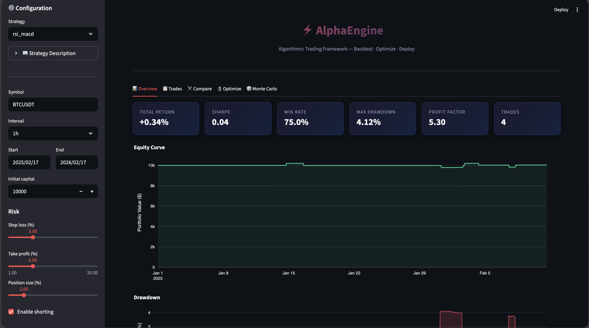
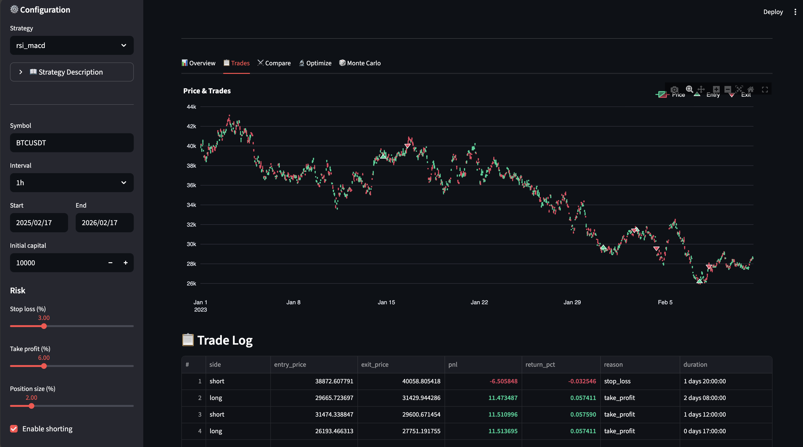
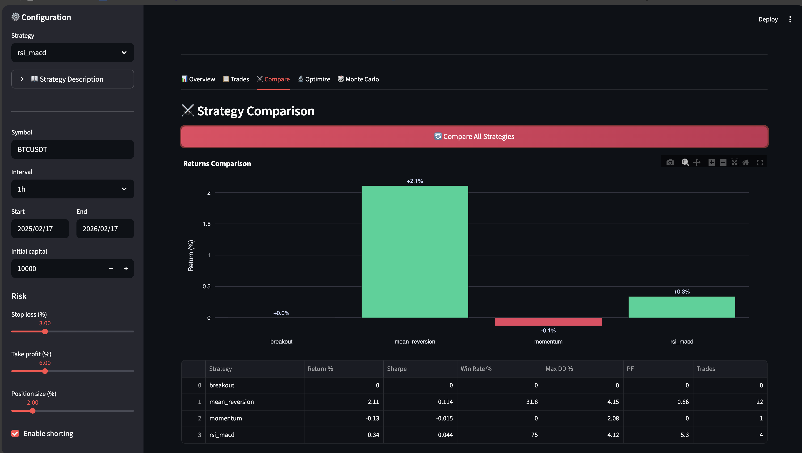
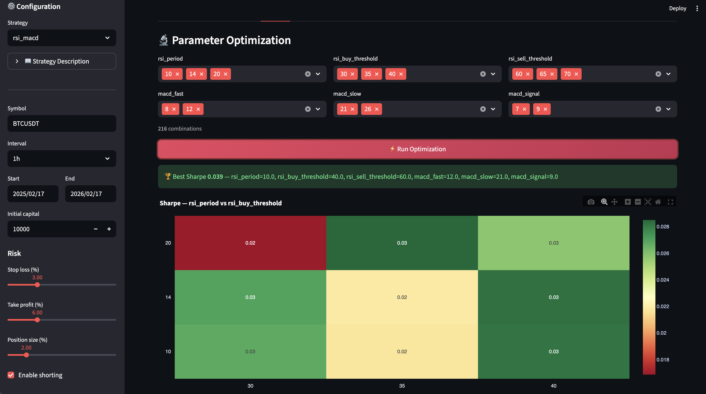
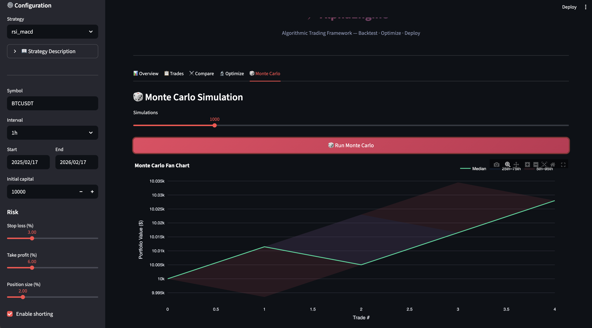

# ⚡ AlphaEngine - Algorithmic Trading Framework

**Professional-grade Python framework for backtesting, optimizing, and deploying trading strategies.**


---

## 🖥️ Dashboard Preview

### Equity Curve & Metrics


### Trade Visualization


### Strategy Comparison


### Parameter Optimization


### Monte Carlo Stress Testing


---

## What is AlphaEngine?

AlphaEngine is a **complete algorithmic trading framework** for serious quant traders. It includes 5 production-ready strategies, an interactive dashboard, walk-forward optimization, Monte Carlo simulation, and multi-exchange support.

This repo contains the **free demo** with 1 strategy (Momentum) and basic backtesting.

### 🔓 Free Demo (this repo)
- ✅ Momentum strategy
- ✅ 15 technical indicators (computed from scratch)
- ✅ Portfolio tracker with commission/slippage
- ✅ Performance metrics (Sharpe, Sortino, win rate, etc.)
- ✅ Position sizing
- ✅ **Run provenance logging** - every backtest captures the *why*, not just the *what*

### 🔒 Full Version ([Get it here →](https://leotaby.gumroad.com/l/alphaengine))
- ✦ **5 strategies**: Momentum, Mean Reversion, Breakout, RSI+MACD, Grid Trading
- ✦ **Interactive Streamlit dashboard** with 5 tabs
- ✦ **Parameter optimization** with Sharpe ratio heatmaps
- ✦ **Monte Carlo simulation** (1000+ scenarios, fan charts)
- ✦ **Risk management suite**: drawdown halts, trailing stops, Kelly criterion
- ✦ **Multi-exchange**: Binance (crypto) + Alpaca (US equities)
- ✦ **MQL5 Expert Advisor** (.mq5 file for MetaTrader 5)
- ✦ Telegram & Discord notifications

---

## Quick Start

```bash
git clone https://github.com/Leotaby/alpha-engine.git
cd alpha-engine
pip install numpy pandas
python demo.py
```

Output:
```
╔══════════════════════════════════════════════════════════╗
║   ⚡  A L P H A  E N G I N E  —  Free Demo              ║
╚══════════════════════════════════════════════════════════╝

📊 Generated 1000 bars | $28,521 — $44,182

  ▸ Running Momentum strategy... ✓

════════════════════════════════════════════════════════════
  Total Return         +0.23%
  Sharpe Ratio         0.040
  Win Rate             100.0%
  Max Drawdown         2.05%
  Profit Factor        0.00
  Total Trades         2
════════════════════════════════════════════════════════════

  📝 Run saved → ID: f7e302ab  (logs/run_history.json)

────────────────────────────────────────────────────────
  Run ID       : f7e302ab
  Strategy     : momentum  |  BTC/USDT  |  1h
  Regime       : trending
────────────────────────────────────────────────────────
  HYPOTHESIS
  Default dual-EMA crossover with ADX > 25 to confirm trend
  strength. Baseline run before any parameter tuning.
────────────────────────────────────────────────────────
  PARAMETERS
    fast_period            12
    slow_period            26
    adx_threshold          25.0
────────────────────────────────────────────────────────
  RESULTS
    Total Return           +0.23%
    Sharpe Ratio           0.040
    Win Rate               100.0%
────────────────────────────────────────────────────────

  📋 Run History
  ID         Strategy    Regime      Return%  Sharpe  Trades
  f7e302ab   momentum    trending      +0.23   0.040       2
```

---

## Run Provenance Logging

One of the hardest problems in systematic trading is remembering *why* you chose a specific configuration — not just what the parameters were. AlphaEngine solves this with a lightweight `RunContext` layer built into every backtest.

Every run captures:

```python
ctx = RunContext(
    strategy_name="momentum",
    params={"fast_period": 12, "slow_period": 26, "adx_threshold": 25.0},
    hypothesis="ADX > 25 filters noise in ranging BTC markets. Testing baseline before tuning.",
    market_regime="trending",   # trending | ranging | volatile | mean-reverting
    symbol="BTC/USDT",
    tags=["baseline", "crypto", "adx-filter"],
    notes="Synthetic data — alternating trending/ranging regimes every 200 bars.",
)
```

Results are automatically persisted to `logs/run_history.json`. You can query your full history:

```python
from core.run_logger import RunLogger

log = RunLogger("logs/run_history.json")

# Top 5 runs by Sharpe ratio
best = log.top_n(metric="sharpe_ratio", n=5)

# Filter by strategy and regime
trending = log.filter(strategy="momentum", regime="trending")

# Side-by-side parameter + result comparison
log.compare("f7e302ab", "a1b2c3d4")
```

The edge lives in the assumption that drove the setup, not just the parameters.

---

## Add Your Own Strategy

Even in the free version, you can create custom strategies:

```python
from strategies.base_strategy import BaseStrategy

class MyStrategy(BaseStrategy):
    name = "my_strategy"
    default_params = {"fast": 10, "slow": 30}
    
    @property
    def description(self):
        return "My custom crossover strategy."
    
    @property
    def param_grid(self):
        return {"fast": [5, 10, 15], "slow": [20, 30, 40]}
    
    def generate_signals(self, df):
        from utils.indicators import ema
        df = ema(df, self.params["fast"])
        df = ema(df, self.params["slow"])
        df["signal"] = 0
        df.loc[df[f"ema_{self.params['fast']}"] > df[f"ema_{self.params['slow']}"], "signal"] = 1
        df.loc[df[f"ema_{self.params['fast']}"] < df[f"ema_{self.params['slow']}"], "signal"] = -1
        return df
```

---

## Full Version Pricing

| | Starter | Pro ⭐ | Premium |
|---|---------|--------|---------|
| **Price** | $79 | $129 | $249 |
| Strategies | 2 | **5** | **5** |
| Dashboard | Basic | **Full (5 tabs)** | **Full** |
| Optimizer | ❌ | ✅ | ✅ |
| Monte Carlo | ❌ | ✅ | ✅ |
| Risk Suite | Basic | **Full** | **Full** |
| Exchanges | 1 | **2** | **2** |
| MQL5 EA | ❌ | ❌ | ✅ |
| Support | Email | Priority | **Video call** |

### [👉 Get AlphaEngine Pro →](https://leotaby.gumroad.com/l/alphaengine)

---

## Tech Stack

- **Python 3.10+** - core framework
- **Streamlit** - interactive dashboard
- **Plotly** - professional charts
- **NumPy/Pandas** - data processing
- **MQL5** - MetaTrader 5 Expert Advisor

---

## Disclaimer

This software is for **educational and research purposes only**. It is not financial advice. Past performance does not guarantee future results. Always do your own research before trading with real money.

---

Built with 🧠 by a quantitative finance professional.
